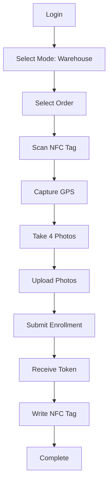
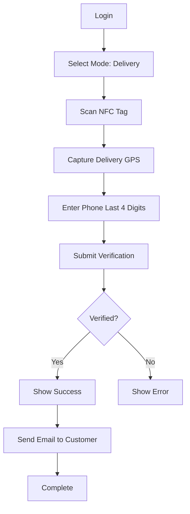

# NFC Warehouse App - Complete Documentation

## 📋 Table of Contents
1. [Project Overview](#project-overview)
2. [Technical Architecture](#technical-architecture)
3. [Features & Functionality](#features--functionality)
4. [Setup & Installation](#setup--installation)
5. [User Workflows](#user-workflows)
6. [API Integration](#api-integration)
7. [Deployment Guide](#deployment-guide)
8. [Troubleshooting](#troubleshooting)

---

## 📦 Project Overview

### **Purpose**
The NFC Warehouse App is a Progressive Web Application (PWA) designed for warehouse and delivery operations. It enables warehouse staff to enroll products with NFC tags and allows delivery personnel to verify packages at delivery locations.

### **Key Capabilities**
- **Warehouse Mode (Enroll)**: Scan NFC tags, capture 4 product photos, and enroll packages with GPS location
- **Delivery Mode (Verify)**: Scan NFC tags at delivery to verify package authenticity and location
- **Cross-Platform**: Works on both iOS (via native bridge) and Android (via Web NFC API)
- **Offline-First Ready**: Designed to work with limited connectivity

### **Technology Stack**
- **Frontend Framework**: React 19.2.0
- **Language**: TypeScript 5.9.3
- **Build Tool**: Vite 7.2.4
- **Routing**: React Router DOM 7.9.6
- **Styling**: Vanilla CSS with modern design patterns

---

## 🏗️ Technical Architecture

### **Project Structure**
```
NFC/
├── src/
│   ├── pages/           # Application pages/screens
│   │   ├── Login.tsx    # Authentication page
│   │   ├── Home.tsx     # Mode selection (Warehouse/Delivery)
│   │   ├── SelectOrder.tsx  # Order selection
│   │   ├── ScanNFC.tsx  # NFC tag scanning
│   │   ├── Confirm.tsx  # Photo upload & enrollment
│   │   ├── WriteNFC.tsx # NFC tag writing
│   │   └── TestConnection.tsx  # API testing
│   ├── App.tsx          # Main app component with routing
│   ├── App.css          # Application styles
│   ├── index.css        # Global styles
│   └── main.tsx         # Entry point
├── public/              # Static assets
├── index.html           # HTML template
├── vite.config.ts       # Vite configuration
├── tsconfig.json        # TypeScript configuration
└── package.json         # Dependencies & scripts
```

### **Key Technologies & Dependencies**

#### **Core Dependencies**
```json
{
  "react": "^19.2.0",
  "react-dom": "^19.2.0",
  "react-router-dom": "^7.9.6"
}
```

#### **Development Tools**
```json
{
  "@vitejs/plugin-react": "^5.1.1",
  "typescript": "~5.9.3",
  "vite": "^7.2.4",
  "eslint": "^9.39.1"
}
```

### **Environment Configuration**
The app uses environment variables for API configuration:

**.env File**
```bash
# Production API URL
VITE_API_BASE_URL=https://shopifyapp.terzettoo.com

# For local development, use:
# VITE_API_BASE_URL=http://localhost:3000
```

### **NFC Implementation**

The app supports two NFC modes:

1. **iOS Native Bridge** (for iOS wrapper app)
   - Uses WebKit message handlers
   - Communicates via `window.webkit.messageHandlers.nfcBridge`
   - Callbacks: `window.handleIOSScan`, `window.handleIOSWriteResult`

2. **Web NFC API** (for Android/Chrome)
   - Uses standard `NDEFReader` API
   - Supports both reading and writing NFC tags
   - Works on Android Chrome with NFC permission

---

## ⚡ Features & Functionality

### **1. Authentication (Login.tsx)**
- Simple password-based login
- Stores employee credential in localStorage
- Validates against backend warehouse list

### **2. Mode Selection (Home.tsx)**
Users can select between two operational modes:
- **🏭 Warehouse (Enroll)**: For product enrollment at warehouse
- **🚚 Delivery (Verify)**: For package verification at delivery

### **3. Order Selection (SelectOrder.tsx)**
- Fetch and display active orders from backend
- Search/filter orders
- Select order for enrollment/verification

### **4. NFC Scanning (ScanNFC.tsx)**

#### **Features**
- Supports iOS and Android NFC scanning
- Auto-detects device type and uses appropriate API
- Captures GPS location automatically on scan
- Validates NFC tag serial number

#### **iOS Flow**
```typescript
// Trigger iOS native NFC scan
window.webkit?.messageHandlers?.nfcBridge?.postMessage("startScan");

// Receive result via callback
window.handleIOSScan = (nfcUid: string) => {
  handleTagRead(nfcUid);
};
```

#### **Android Flow**
```typescript
const ndef = new NDEFReader();
await ndef.scan();
ndef.onreading = (event) => {
  const serialNumber = event.serialNumber;
  handleTagRead(serialNumber);
};
```

### **5. Photo Upload & Enrollment (Confirm.tsx)**

#### **Photo Management**
- **Requirement**: Exactly 4 photos per package
- **Compression**: Auto-compresses to max 1024x1024px at 70% quality
- **Format**: Converts to JPEG
- **Preview**: Shows 2x2 grid preview
- **Upload**: Sequential upload to backend with retry logic

#### **Enrollment Process**
1. Select/capture 4 photos
2. Compress images locally
3. Upload to backend cloudinary storage
4. Send enrollment payload to `/api/enroll`:
```json
{
  "order_id": "1234",
  "serial_number": "ef:8b:c4:c3",
  "photo_urls": ["https://...", "https://...", ...],
  "photo_hashes": ["hash1", "hash2", ...],
  "shipping_address_gps": {
    "lat": 40.7580,
    "lng": -73.9855
  }
}
```

### **6. NFC Tag Writing (WriteNFC.tsx)**

#### **Purpose**
Write the generated INK token URL to the NFC tag for verification.

#### **URL Format**
```
http://in.ink/t/{token}
```

#### **Features**
- Displays order ID and token before writing
- Supports iOS and Android write methods
- Retry mechanism on failure
- Skip option for manual writing later
- Success/error feedback

#### **iOS Write Flow**
```typescript
const urlToWrite = `http://in.ink/t/${nfcToken}`;
window.webkit?.messageHandlers?.nfcWriteBridge?.postMessage(urlToWrite);

window.handleIOSWriteResult = (success: boolean, error?: string) => {
  // Handle result
};
```

#### **Android Write Flow**
```typescript
const ndef = new NDEFReader();
await ndef.write({
  records: [{
    recordType: "url",
    data: urlToWrite
  }]
});
```

### **7. Connection Testing (TestConnection.tsx)**
- Tests connectivity to backend API
- Validates API endpoints
- Displays network status
- Useful for troubleshooting deployment issues

---

## 🚀 Setup & Installation

### **Prerequisites**
- Node.js >= 18.x
- npm or yarn
- Modern browser (Chrome/Safari)
- NFC-enabled device (for production use)

### **Installation Steps**

#### **1. Clone & Install**
```bash
cd e:/Shopify/NFC
npm install
```

#### **2. Environment Configuration**
Create/edit [.env](file:///e:/Shopify/NFC/.env) file:
```bash
# Production
VITE_API_BASE_URL=https://shopifyapp.terzettoo.com

# Development
# VITE_API_BASE_URL=http://localhost:3000
```

#### **3. Development Server**
```bash
npm run dev
```
This will start Vite dev server at `http://localhost:5173`

#### **4. Build for Production**
```bash
npm run build
```
Output will be in `dist/` directory.

#### **5. Preview Production Build**
```bash
npm run preview
```

---

## 👥 User Workflows

### **Warehouse Enrollment Workflow**



**Detailed Steps:**
1. **Login** with warehouse credentials
2. **Select "Warehouse (Enroll)"** mode
3. **Choose order** from active orders list
4. **Scan NFC tag** on product
5. GPS location is **automatically captured**
6. **Take 4 photos** of the package (all angles)
7. **Upload photos** to server
8. **Submit enrollment** - backend processes and returns token
9. **Write token URL** to NFC tag
10. **Complete** and return to home

### **Delivery Verification Workflow**



**Detailed Steps:**
1. **Login** with delivery credentials
2. **Select "Delivery (Verify)"** mode
3. **Scan NFC tag** on delivered package
4. GPS location is **automatically captured**
5. **Enter phone last 4 digits** for verification
6. **Submit verification** to `/api/verify`
7. **Backend validates**:
   - GPS proximity to shipping address
   - Phone number match
   - Tag enrollment status
8. **Return Passport email** sent to customer
9. **Complete** and return to home

---

## 🔌 API Integration

### **Backend API Endpoints**

The NFC app communicates with the teststore-1 Shopify backend.

#### **1. POST /api/enroll**

**Purpose**: Enroll a package with NFC tag and photos

**Request**:
```json
{
  "order_id": "1015",
  "serial_number": "ef:8b:c4:c3",
  "photo_urls": [
    "https://res.cloudinary.com/...",
    "https://res.cloudinary.com/...",
    "https://res.cloudinary.com/...",
    "https://res.cloudinary.com/..."
  ],
  "photo_hashes": ["sha256hash1", "sha256hash2", "sha256hash3", "sha256hash4"],
  "shipping_address_gps": {
    "lat": 40.7580,
    "lng": -73.9855
  }
}
```

**Response**:
```json
{
  "success": true,
  "proof_id": "proof_abc123...",
  "enrollment_status": "enrolled",
  "key_id": "key_xyz...",
  "token": "token_def456..."
}
```

#### **2. POST /api/verify**

**Purpose**: Verify package delivery

**Request**:
```json
{
  "serial_number": "ef:8b:c4:c3",
  "delivery_gps": {
    "lat": 40.7582,
    "lng": -73.9850
  },
  "device_info": "iPhone 14",
  "phone_last4": "5678"
}
```

**Response**:
```json
{
  "proof_id": "proof_abc123...",
  "verification_status": "verified",
  "gps_verdict": "within_range",
  "distance_meters": 45.3,
  "signature": "cryptographic_signature",
  "verify_url": "https://in.ink/verify/proof_abc123"
}
```

**Error Responses**:
- `403`: Phone verification failed
- `404`: Tag not enrolled
- `500`: Server error

#### **3. POST /api/photos/upload**

**Purpose**: Upload individual photo to Cloudinary

**Request**: FormData
```
photo: <File>
orderId: "1015"
photoIndex: "0"
```

**Response**:
```json
{
  "success": true,
  "photoUrl": "https://res.cloudinary.com/...",
  "photoHash": "sha256_hash_of_image"
}
```

---

## 🌐 Deployment Guide

### **Deployment Options**

#### **Option 1: Netlify/Vercel (Recommended)**

**Netlify Deployment:**
```bash
# Build the app
npm run build

# Deploy to Netlify
netlify deploy --prod --dir=dist
```

**Environment Variables** (Set in Netlify UI):
```
VITE_API_BASE_URL=https://shopifyapp.terzettoo.com
```

#### **Option 2: Static Hosting (AWS S3, Azure, etc.)**

```bash
# Build
npm run build

# Upload dist/ folder to your hosting service
```

#### **Option 3: Self-Hosted (Nginx)**

**Nginx Configuration**:
```nginx
server {
    listen 80;
    server_name nfc.yourdomain.com;
    root /var/www/nfc/dist;
    index index.html;

    # SPA routing
    location / {
        try_files $uri $uri/ /index.html;
    }

    # API proxy (optional)
    location /api {
        proxy_pass https://shopifyapp.terzettoo.com;
        proxy_set_header Host $host;
        proxy_set_header X-Real-IP $remote_addr;
    }
}
```

### **iOS Native Wrapper (Optional)**

For iOS NFC support, wrap the PWA in a native iOS app:

**Required iOS Code** (Swift):
```swift
// WebView with NFC bridge
func setupNFCBridge() {
    webView.configuration.userContentController.add(self, name: "nfcBridge")
    webView.configuration.userContentController.add(self, name: "nfcWriteBridge")
}

// Handle NFC scan requests
func userContentController(_ userContentController: WKUserContentController, 
                          didReceive message: WKScriptMessage) {
    if message.name == "nfcBridge" {
        startNFCScan()
    } else if message.name == "nfcWriteBridge" {
        let url = message.body as! String
        writeNFCTag(url: url)
    }
}
```

---

## 🔧 Troubleshooting

### **Common Issues**

#### **1. NFC Not Working on iOS**
**Problem**: iOS doesn't support Web NFC API  
**Solution**: Use native iOS wrapper with bridge implementation

#### **2. Photos Not Uploading**
**Problem**: Upload fails with network error  
**Checks**:
- Verify `VITE_API_BASE_URL` is correct
- Check CORS settings on backend
- Ensure Cloudinary credentials are configured
- Check network connectivity

#### **3. GPS Not Capturing**
**Problem**: Location shows 0,0  
**Solutions**:
- Grant location permissions in browser
- Use HTTPS (required for geolocation on most browsers)
- Check device GPS is enabled

#### **4. Build Errors**
**Problem**: TypeScript/build failures  
**Solutions**:
```bash
# Clear cache and reinstall
rm -rf node_modules package-lock.json
npm install

# Clear Vite cache
rm -rf .vite
```

#### **5. API Connection Failed**
**Problem**: Cannot reach backend API  
**Checks**:
- Verify backend is running at `VITE_API_BASE_URL`
- Check network connectivity
- Use TestConnection page to diagnose
- Check browser console for CORS errors

### **Debug Mode**

Enable verbose logging:
```typescript
// In main.tsx or App.tsx
if (import.meta.env.DEV) {
  console.log('🐛 Debug mode enabled');
  console.log('API URL:', import.meta.env.VITE_API_BASE_URL);
}
```

---

## 📊 Performance Considerations

### **Image Compression**
- Photos compressed to max 1024x1024px
- JPEG quality set to 70%
- Average photo size: ~200-300KB

### **Offline Capabilities**
Currently requires network for:
- Photo uploads
- Enrollment/verification API calls

**Future Enhancement**: Implement service worker for offline queueing

---

## 🔐 Security Notes

1. **Authentication**: Currently uses simple password auth - consider implementing JWT tokens
2. **HTTPS Required**: For GPS and NFC on production
3. **Photo Hashing**: SHA-256 hashes ensure photo integrity
4. **No Data Storage**: No sensitive data stored locally (cleared after submission)

---

## 📞 Support Information

**Project Location**: `e:/Shopify/NFC`  
**Backend API**: `https://shopifyapp.terzettoo.com`  
**Technology**: React + TypeScript + Vite  
**Version**: 0.0.0

---

## 📝 Change Log

### Current Version
- React 19.2.0 with modern hooks
- iOS + Android NFC support
- Photo compression and upload
- GPS auto-capture
- NFC tag writing
- Proxy API configuration via Vite

---

**Last Updated**: January 1, 2026  
**Documentation Version**: 1.0.0
